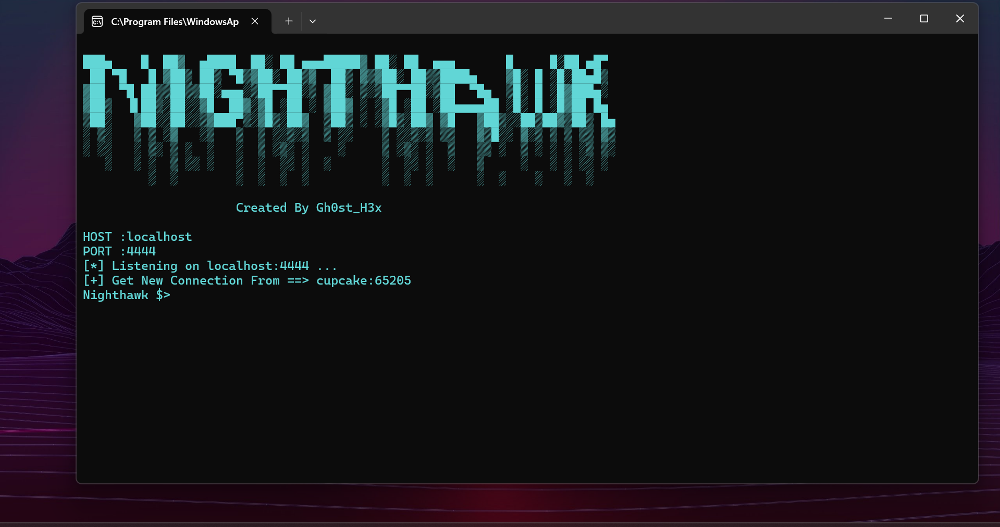
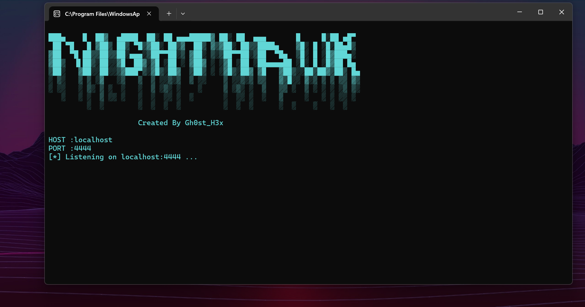

# Night_H4wk (Remote Access Trojan) - Under Development

This is a Python-based RAT (Remote Access Trojan) project that is currently under development. The RAT is designed to provide remote access and control of a target machine over the internet, allowing various actions to be performed stealthily. This project is intended for educational purposes only.

## Features

- [] AntiVM Detection
- [] Obfuscator
- [] Startup Persistence
- [] Fud
- 
<s>This is centered and struck-through text.</s>

- Encrypted Communication
- [x] Shell
- [x] Screenshot
- [x] Information Gathering
- [x] File Download
- [x] File Upload

## Screenshots

Here are some screenshots of the RAT in action:

## Disclaimer

This project is strictly for educational purposes. The developer is not responsible for any misuse of this software.

